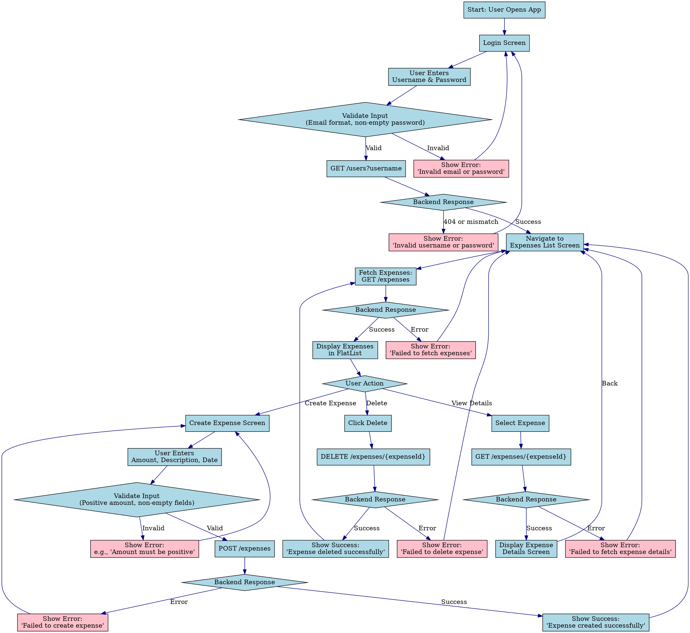

# Personal Finance Tracker Mobile App

## Overview
The Personal Finance Tracker is a React Native mobile application that allows users to manage their expenses by logging in, creating, viewing, and deleting expenses. It interacts with a MockAPI backend to handle user authentication and expense data, with a focus on input validation and error handling.

## Features
- **User Login**: Authenticate users using a valid username (email) and password via GET `/users?username`.
- **Create Expense**: Add new expenses with validated inputs (amount, description, date) using POST `/expenses`.
- **View Expense Details**: Display details of a specific expense using GET `/expenses/{expenseId}`.
- **List Expenses**: Show all expenses with options to view details or delete, using GET `/expenses`.
- **Delete Expense**: Remove a specific expense using DELETE `/expenses/{expenseId}`.
- **Validation**: Ensures valid email for login, positive numbers for amounts, and non-empty fields where required.
- **Error Handling**: Displays user-friendly error messages for invalid inputs or API failures.

## Architecture
The Personal Finance Tracker follows a modular mobile application architecture built with React Native, ensuring scalability, maintainability, and a seamless user experience. Below is a detailed breakdown of all components:

### 1. Frontend Components (React Native)
- **Screens**:
  - **Login Screen**: Collects username (email) and password, validates inputs, and authenticates via the API. Uses `TextInput` for user input and `Button` for submission.
  - **Expenses List Screen**: Displays a list of expenses in a `FlatList`, with each item clickable to view details and a delete button. Includes a button to navigate to the Create Expense screen.
  - **Create Expense Screen**: A form with `TextInput` fields for amount, description, and date, with validation before submitting to the API.
  - **Expense Details Screen**: Displays fetched expense data (amount, description, date) using `Text` components.
- **UI Elements**:
  - `TextInput`: For user input (email, password, amount, description, date).
  - `Button`: For actions like login, create expense, and delete expense.
  - `FlatList`: For rendering the list of expenses.
  - `Text`: For displaying static content and error messages.
  - `Alert`: For success notifications (e.g., expense created or deleted).
- **Styling**: Uses `StyleSheet` for consistent styling across screens, with properties like padding, borders, and font sizes for a clean UI.

### 2. Navigation
- **Library**: React Navigation (Stack Navigator) manages screen transitions.
- **Structure**:
  - **Login Screen**: Initial route, navigates to Expenses List on successful login.
  - **Expenses List Screen**: Central hub, allows navigation to Create Expense or Expense Details.
  - **Create Expense Screen**: Returns to Expenses List after submission.
  - **Expense Details Screen**: Accessible from Expenses List, displays specific expense data.
- **Implementation**: Uses `createStackNavigator` to define a stack-based navigation flow, ensuring smooth transitions and back navigation.

### 3. API Layer
- **Library**: Axios handles all HTTP requests to the MockAPI backend.
- **Endpoints**:
  - `GET /users?username`: Fetches user data for authentication.
  - `POST /expenses`: Creates a new expense with amount, description, and date.
  - `GET /expenses/{expenseId}`: Retrieves details of a specific expense.
  - `GET /expenses`: Fetches all expenses.
  - `DELETE /expenses/{expenseId}`: Deletes a specific expense.
- **Configuration**: Base URL (`https://67ac71475853dfff53dab929.mockapi.io/api/v1`) is defined as a constant for reusability.
- **Error Handling**: All API calls are wrapped in try-catch blocks, with errors displayed to the user via `Text` or `Alert`.

### 4. State Management
- **Approach**: Local state management using React hooks (`useState`, `useEffect`) for simplicity, suitable for the app’s scope.
- **Usage**:
  - **Login Screen**: Manages username, password, and error message states.
  - **Create Expense Screen**: Tracks amount, description, date, and error states.
  - **Expense Details Screen**: Stores fetched expense data and error state.
  - **Expenses List Screen**: Maintains the list of expenses and error state.
- **Lifecycle**: `useEffect` is used for API calls on component mount (e.g., fetching expenses or expense details).

### 5. Validation
- **Login**:
  - Username: Must match email format (regex: `[^\s@]+@[^\s@]+\.[^\s@]+`).
  - Password: Must be non-empty.
- **Create Expense**:
  - Amount: Must be a positive number (checked with `isNaN` and `Number(amount) > 0`).
  - Description: Must be non-empty.
  - Date: Must be non-empty (assumes YYYY-MM-DD format for simplicity).
- **Implementation**: Validation occurs before API calls, with errors displayed via `Text` components.

### 6. Error Handling
- **API Errors**: Network failures or invalid responses are caught in try-catch blocks, with user-friendly messages (e.g., “Failed to fetch expenses”).
- **Input Errors**: Invalid inputs trigger error messages (e.g., “Amount must be a positive number”).
- **UI Feedback**: Errors are displayed in red text below input fields or as alerts for success/failure notifications.

### 7. Backend (MockAPI)
- **Role**: Provides a RESTful API for user authentication and expense management.
- **Data Structure**:
  - **Users**: Contains `username` (email) and `password` fields.
  - **Expenses**: Includes `id`, `amount`, `description`, and `date`.
- **Limitations**: MockAPI is used for prototyping; a production app would require a secure backend with proper authentication (e.g., JWT) and data persistence.

### 8. Dependencies
- **React Native**: Core framework for building the mobile UI.
- **Axios**: For API requests.
- **React Navigation**: For navigation between screens.
- **React Native Screens/Safe Area Context**: Enhances navigation and UI compatibility.

### Architecture Diagram
The dataflow diagram below illustrates the interactions between the user, app, and backend, complementing the component architecture:



## Dataflow Diagram
The above Graphviz diagram illustrates the dataflow between the user, the React Native app, and the MockAPI backend, as described in the architecture section.

## Pages
- **Login Screen**: Input fields for username (email) and password with validation.
- **Expenses List Screen**: Lists all expenses with options to view details or delete.
- **Create Expense Screen**: Form to input amount, description, and date with validation.
- **Expense Details Screen**: Displays details of a selected expense.

## Setup Instructions
1. **Prerequisites**:
   - Node.js and npm installed.
   - React Native environment (Expo or React Native CLI).
   - A simulator/emulator or physical device for testing.

2. **Install Dependencies**:
   ```bash
   npm install axios @react-navigation/native @react-navigation/stack react-native-screens react-native-safe-area-context
   ```

3. **Run the App**:
   - Start the development server:
     ```bash
     npx react-native run-android
     # or
     npx react-native run-ios
     ```
   - Ensure the MockAPI backend (`https://67ac71475853dfff53dab929.mockapi.io/api/v1`) is accessible.

4. **API Endpoints**:
   - `GET /users?username`: Authenticate user credentials.
   - `POST /expenses`: Create a new expense.
   - `GET /expenses/{expenseId}`: Fetch expense details.
   - `GET /expenses`: List all expenses.
   - `DELETE /expenses/{expenseId}`: Delete an expense.

## Validation
- **Login**: Username must be a valid email (regex: `[^\s@]+@[^\s@]+\.[^\s@]+`), and password must be non-empty.
- **Create Expense**: Amount must be a positive number, description and date must be non-empty.
- **Error Messages**: Clear feedback for invalid inputs (e.g., “Invalid username or password”) or API errors (e.g., “Failed to fetch expenses”).

## Technologies Used
- **React Native**: For building the mobile app.
- **Axios**: For API interactions.
- **React Navigation**: For screen navigation.
- **MockAPI**: Backend for user and expense data.
